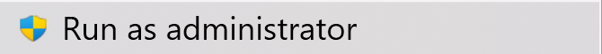
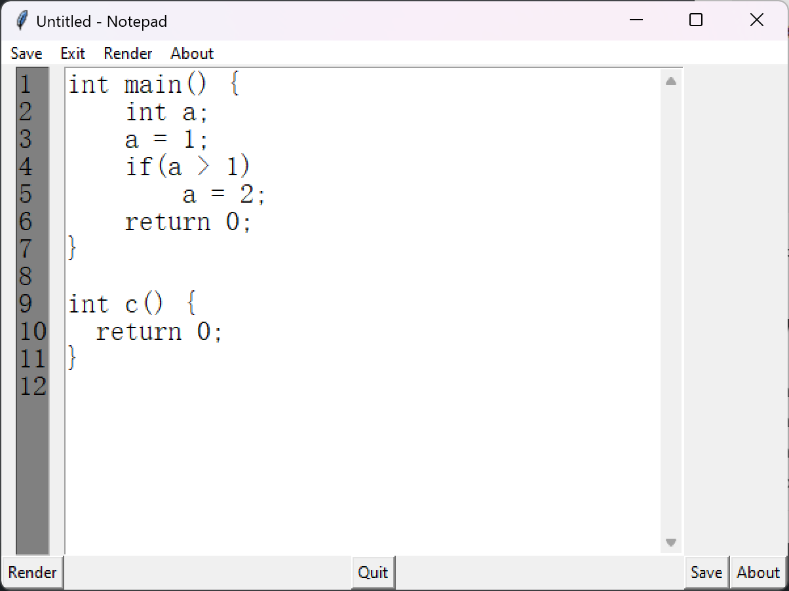

# Compiler-Principles-2024-Spring

- exp_code for compiler principles lesson.
- [source](https://github.com/Sentixxx/Simple-Compiler)

## How to Use(New)

### Right click the "SETUP.bat" with "run as adminstrator"



### Select "Add Graphviz to the system PATH for current user"


### Click "RUN.bat" and enter your code in the window



### Click Render

result will be shown in a few seconds

## How to Use

<details>
  <summary>Install Make on Ubuntu</summary>

```bash
$ sudo apt update
```

check is make installed

```bash
$ make -version
```

after run this command, you got the following error?

- **bash: /usr/bin/make: No such file or directory**

then follow with the next step, otherwise skip the next commands

```bash
$ sudo apt install make
```

### Troubleshooting's?

- Follow this guide https://linuxhint.com/install-make-ubuntu/
</details>

<details>
  <summary>Install Make on Mac</summary>

check is make installed

```bash
$ make -version
```

after run this command, you got the following error?

- **zsh: command not found: make**

then follow with the next step, otherwise skip the next commands

```bash
$ (sudo) brew install make
```

</details>

<details>
  <summary>Install Make on Windows</summary>

Follow this Guide
https://sp21.datastructur.es/materials/guides/make-install.html#windows-installation

</details>

- go to the downloaded/ cloned folder with your terminal/ powershell (windows) and run the following command

```bash
$ make start
```

## How to input the code

Modify the following file: `Data/raw_code.txt`
